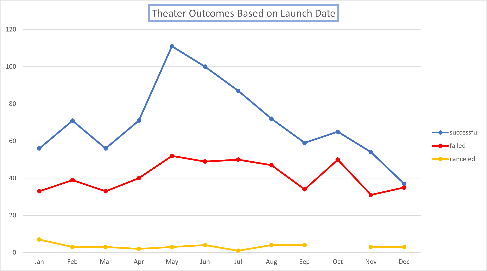

# An Analysis of Kickstarter Campaigns

Performing analysis on Kickstarter data to uncover trends

## Overview of Project
---
Utilizing the data from more than 1000 Kickstarter campaigns, we sought to identify trends that would lead to the success for your production.
---
### Purpose

When organizing a campaign to support the production of your play *Fever*, it is important to see what choices have led to positive outcomes previously. We have analyzed the provided data with an eye toward identifying those characteristics that you can control, and have found two factors that will have a significant impact on the success of your upcoming campaign:

-When do you start?

-How big is your goal?

---
## Analysis and Challenges

We identified these two factors primarily based on the significance of their impact on success, and the ease with which we have control over them. It is unsurprising to find the correlation between the launch date of a campaign and it's success, given the economic cycles that drive such giving. Looking at the data for success based on the goal of the campaign provided some interesting insights to consider.

### Analysis of Outcomes Based on Launch Date

Kickstarter campaigns started in early summer are more successful than those started at other times of the year. May is the most successful month to start your campaign, with June second and July third. This follows as we might expect, as overall charitable giving to cultural causes spikes in early summer. See: [https://mrbenchmarks.com/journeys#fundraising](https://mrbenchmarks.com/journeys#fundraising).

As we can see, campaigns started in May are most successful, as they span the early summer giving period. This is clearly a popular time to start a campaign, and there is a lot of competition, but the chance of success is clearly highest with a May start date. All things being equal, there are 2 successful campaigns to every failed one started in the month of May.

### Analysis of Outcomes Based on Goals

Determining the Goal of the campaign is a bit harder. Those campaigns asking for a modest amount - up to $5000 - were successful nearly 3 out of 4 times. As the goal gets bigger, the chance of success falls. Indeed, from $15,000 to $35,000 the chances of success are less than 50%.

From $35,000 to $45,000 the chance of success goes back to the rates we saw at $5000! Better than two to one! 

The lesson here is to either ask for a modest amount, hoping to run another campaign later as plans to "take the show on the road" are solidified, or to "shoot the moon" with funding for both North American and British productions being funded in one round. 

### Challenges and Difficulties Encountered

The dataset provided only a limited snapshot of the Kickstarters over time, as it was comprised of 1066 relevant records from 2010 to 2017. The dataset did not include alternative crowdfunding sources like Indiegog or GiveSendGo. The dataset showed some anomalies, like some categories showing no successful campaigns, and further investigation of the data source may be warranted.

---
## Results

Successful Kickstarter campaigns for plays start in May and ask for either $5000 or $45,000. 

The later you start, the lower the chances of success. If the campaign cannot start during the summer months, February provides a bright spot. But clearly May is the optimum time to start, allowing you to run the campaign over the early summer.

The data provided suggests that the chances of success are about the same asking for $45,000 as they are at $5000, so it would make sense to do the campaign for that amount. If it fails, you can always try again for the more modest goal.

Other analyses that could provide addition insights would be to explore the relationship between average contribution and success rates. This would help identify campaigns that rely on large individual contributions to reach their goal. Additionally, comparing average contributions versus month could lead to interesting conclusions. 

Expanding our analysis beyond Kickstarter to more focused crowdfunding sites could lead to more success, but further analysis is recommended to be certain.
ng analysis on Kickstarter data to uncover trends

